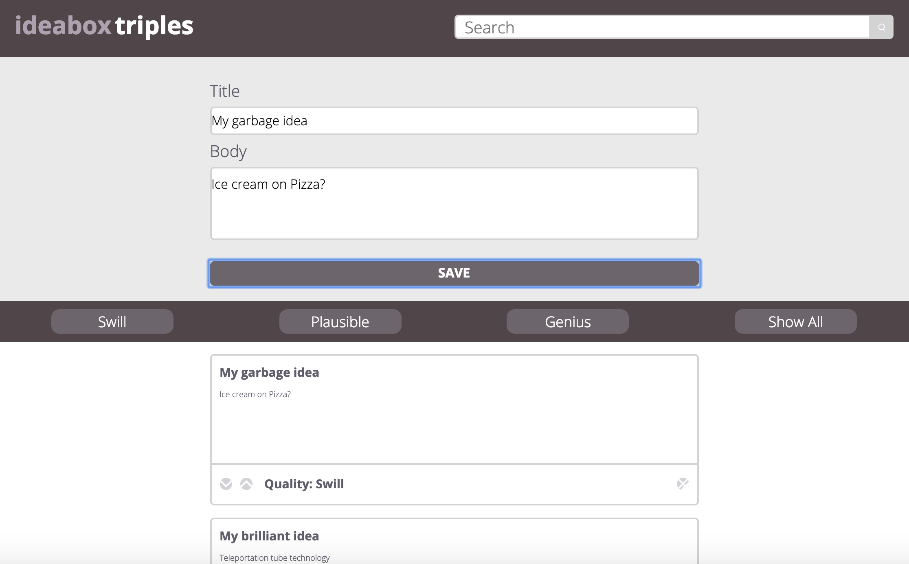
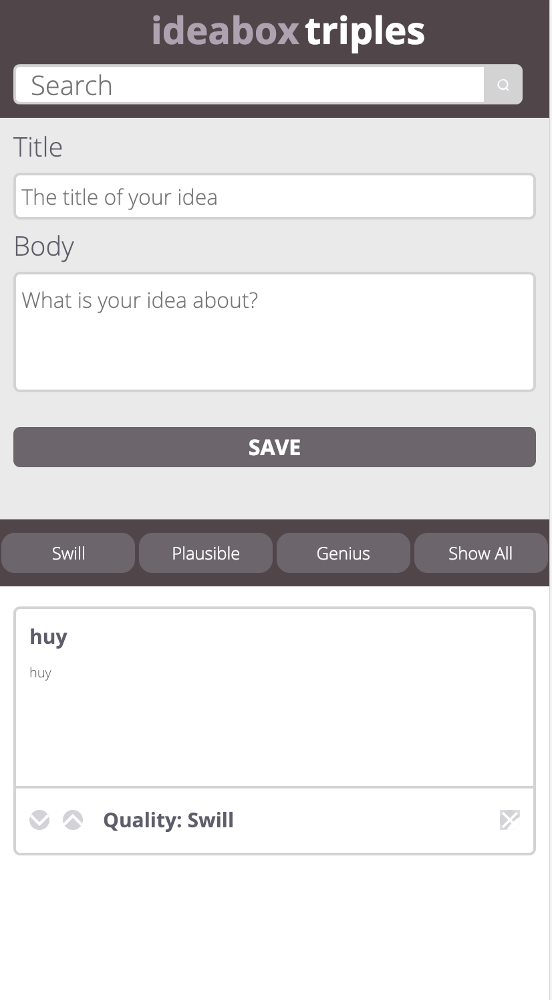
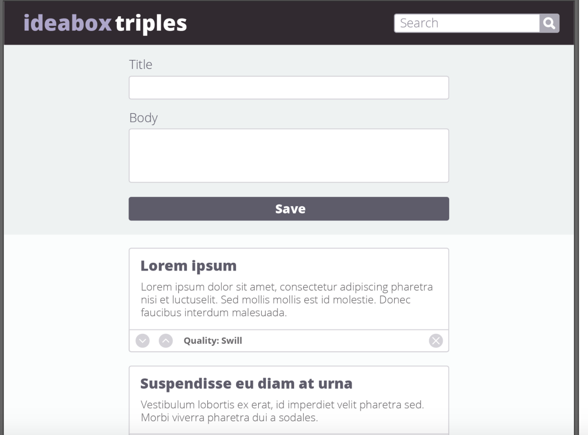

# Ideabox
### By [Mason](https://github.com/francepack), [Rachael](https://github.com/rdren0), [Duy](https://github.com/Rosebud303)

This was a group project completed for Turing school Mod 1. For this project, we were given a website comp to recreate with Javascript functionality, including utilizing local storage. Our website allows a user to record their ideas, save these ideas to local storage, and filter them by 'quality'. If an idea is deleted, it is also removed from storage.

### Screenshots
Our site:

Mobile view:

The comp:

## What We gained from this project
In making this site, we bolstered our knowledge of local storage, and learned a lot about collaboration. The experience of using gitHub and Slack to communicate about ideas and assignments will help us as we pursue careers in a collaborative field. We found that we functioned very well as a team due to our clear communication and willingness to take on challenges individually and bring our findings back to the group to discuss.
